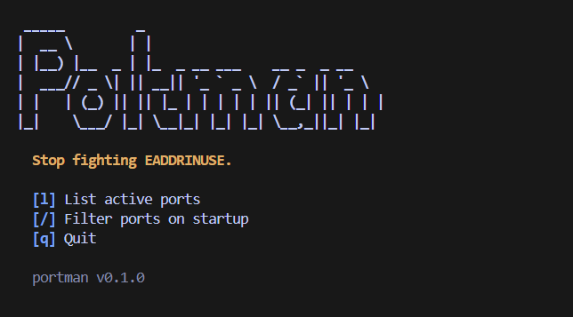

# portman

> Stop fighting EADDRINUSE.

portman is a terminal port manager for developers. It shows which process owns each local port and lets you kill it — without memorizing `lsof`, `netstat`, or `ss`.



---

## Why

Every developer running local servers eventually hits this:

```
Error: listen EADDRINUSE: address already in use :::3000
```

Finding the culprit takes three commands you never remember. portman gives you one.

---

## Features

- Live TUI dashboard — active ports, process names, PIDs, and states at a glance
- Kill by port or process name, with confirmation before anything is terminated
- SIGTERM first, SIGKILL only when you ask for it
- Warns before touching known system processes (postgres, nginx, redis, etc.)
- JSON output for scripting and piping
- Single static binary — no runtime, no config, no setup

---

## Installation

**Go install**

```bash
go install github.com/RahmatHadinata23758051/Portman@latest
```

**Homebrew** (coming soon)

```bash
brew install RahmatHadinata23758051/tap/portman
```

**Manual download**

Pre-built binaries for Linux, macOS, and Windows are available on the [Releases](https://github.com/RahmatHadinata23758051/Portman/releases) page.

---

## Usage

### Open the dashboard

```bash
portman
```

Launches the home screen. Press `l` to start scanning ports, `/` to open with a filter, or `q` to quit.

```bash
portman filter node
```

Skips the home screen and opens the live dashboard pre-filtered for `node`.

### List ports

```bash
portman list
```

Prints all LISTEN ports in a clean aligned table.

```
PORT   PROCESS     PID    STATE   ADDRESS    PROTOCOL
3000   node        12345  LISTEN  0.0.0.0    tcp
5432   postgres    1203   LISTEN  0.0.0.0    tcp
6379   redis-ser…  1391   LISTEN  127.0.0.1  tcp
```

```bash
portman list --all
```

Includes ESTABLISHED outbound connections as well.

```bash
portman list --json
```

Outputs JSON to stdout. Nothing else — safe to pipe.

```json
[
  {
    "port": 3000,
    "address": "0.0.0.0",
    "protocol": "tcp",
    "pid": 12345,
    "process": "node",
    "state": "LISTEN"
  }
]
```

### Kill a process

**By port**

```bash
portman kill 3000
```

```
Found node PID 12345 using port 3000.
Kill this process? [y/N]
```

**By process name**

```bash
portman kill node
```

If multiple processes match, all are listed before you confirm. No partial kills.

**Skip confirmation** (for scripts)

```bash
portman kill 3000 --yes
```

**Force kill** (SIGKILL instead of SIGTERM)

```bash
portman kill 3000 --force
```

`--yes` and `--force` are independent flags.

---

## TUI keybindings

| Key | Action |
|-----|--------|
| `↑` / `↓` | Navigate |
| `l` / `Enter` | Open port list |
| `k` | Kill selected process |
| `r` | Refresh manually |
| `/` | Filter by port or process name |
| `Esc` | Exit filter mode |
| `q` | Quit |

---

## Safety

portman will not terminate a process without your confirmation unless `--yes` is provided.

Termination defaults to SIGTERM. SIGKILL is only used when `--force` is passed.

If the process name matches a known long-running service, portman warns you before asking:

```
Warning: postgres may be a long-running database process.
Confirm carefully or use --force only if you are sure.
```

Guarded process names: `systemd`, `launchd`, `svchost`, `postgres`, `mysql`,
`redis-server`, `docker`, `dockerd`, `containerd`, `sshd`, `nginx`, `apache2`.

---

## Commands

| Command | Description |
|---------|-------------|
| `portman` | Open interactive TUI |
| `portman list` | Print active LISTEN ports |
| `portman list --all` | Include ESTABLISHED connections |
| `portman list --json` | JSON output |
| `portman kill <port\|name>` | Kill process by port or name |
| `portman kill <port> --yes` | Skip confirmation |
| `portman kill <port> --force` | Force kill with SIGKILL |
| `portman filter <query>` | Open TUI with filter pre-applied |
| `portman version` | Print version |

---

## Roadmap

| Version | Scope |
|---------|-------|
| `v0.1.0` | CLI list and kill |
| `v0.2.0` | Live TUI dashboard |
| `v0.3.0` | JSON output, filtering, home screen |
| `v0.4.0` | Windows process resolution improvements |
| `v1.0.0` | Stable cross-platform release |

---

## Contributing

1. Fork the repository and create a branch for your change
2. Run `go test ./...` before submitting
3. Format with `gofmt` — unformatted code will not be merged
4. Keep pull requests focused — one change per PR

---

## License

MIT — see [LICENSE](./LICENSE) for details.